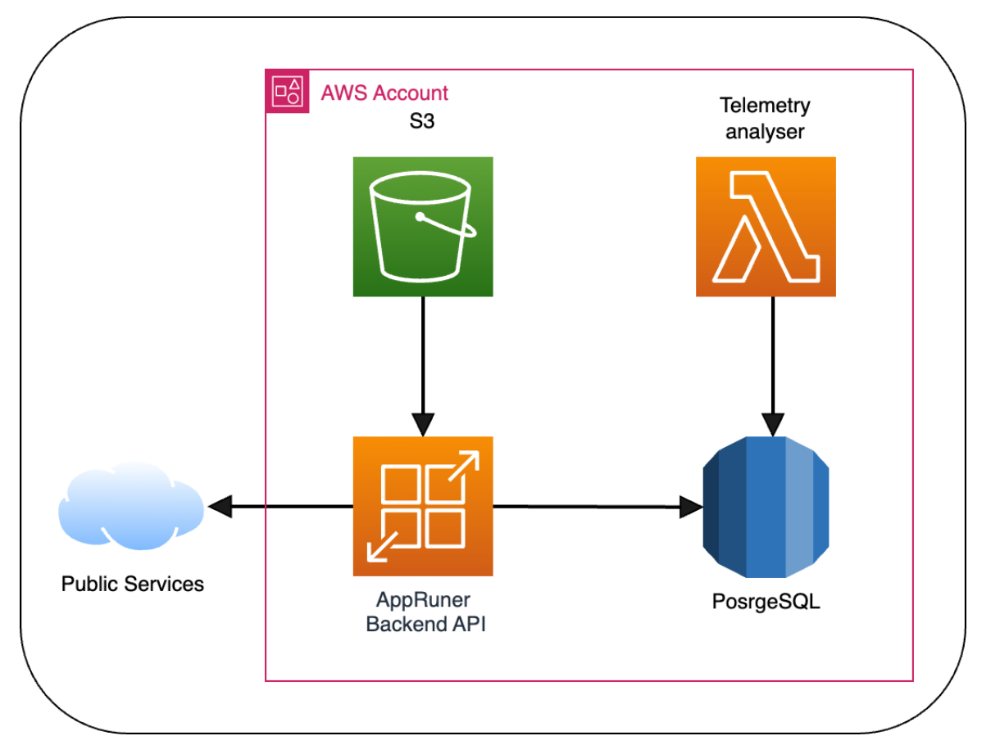

# Mission OPS example project
A sample project to deploy apps in AWS

Here is a high-level diagram of the example deployments:



## Initial AWS environment setup

This repo has several prerequisites:
- you should have a valid AWS environment with a pre-setup awscli and proper authentication


First, we need to create an S3 bucket for the soul purpose of storing the terraform state.
*Note*: we are not going to use a consensus mechanics in the form of a DynamoDB database in this example.
```
aws s3api create-bucket --bucket <prefix>-state --region <region> --create-bucket-configuration LocationConstraint=<region>
```

Example:
```
aws s3api create-bucket --bucket mission-ops-state --region eu-central-1 --create-bucket-configuration LocationConstraint=eu-central-1
```

*Improtant*:
Since the terraform state stores very important resources and they are very small in size,
it is strongly recommended to enable S3 bucket versioning:

```
aws s3api put-bucket-versioning --bucket <bucket> --versioning-configuration Status=Enabled
```

Example:
```
aws s3api put-bucket-versioning --bucket mission-ops-state --versioning-configuration Status=Enabled
```

### Initiating Terraform environment

Before running everything, take note of the variables in `terraform/backend.tfvars`.
Those are needed for the initial setup and should reflect your environment and the bucket you created in the previous step.


To initiate the terraform state simply run:
```
cd terraform
terraform init -backend-config=backend.tfvars
```

Expected result:
```
Terraform has been successfully initialized!
```

### Decrypt the secrets

Secret variables (even the default ones) were encrypted using gpg. To decrypt them simply do (with the provided passphrase):

```
cd terraform
gpg --decrypt secrets.tfvars.gpg > secrets.tfvars
```

*Note*: The command used to encrypt is the following (you may need it if you wish to add new variables or change existing ones):
```
echo <passphrase> | gpg --batch --yes --symmetric --cipher-algo AES256 --armor --output secrets.tfvars.gpg --passphrase-fd 0 secrets.tfvars
```

### Apply Terraform code

We are ready to finally create all the resources in the environment.
To do that, simpy execute:

```
cd terraform
terraform apply -var-file=secrets.tfvars
```

## Style Guide:
- App names are kebap-cased
- variables are snake_cased
